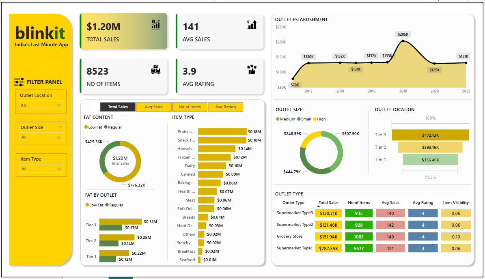

# 📦 Blinkit Sales Analysis Dashboard

An interactive Power BI report that analyzes sales performance, outlet characteristics, item distribution, and customer ratings for Blinkit – India’s Last Minute App. This dashboard provides clear insights into outlet size, sales by item types, regional performance, and trends over time.

---

## 📊 Project Overview

This dashboard is designed to help Blinkit and similar retail/e-commerce platforms identify patterns in product sales, evaluate store-type performance, and understand customer preferences across different tiers and outlet types. It empowers data-driven decisions on inventory planning, store development, and marketing strategies. It is performed on the grocery dataset of blinkit where fat content analysis was priotised.

---

## 🧠 Key Highlights

- **Total Sales**: $1.20M
- **Average Sales**: $141
- **Total Items**: 8,523
- **Average Rating**: 3.9 ⭐

---

## 🔍 Visuals & Features

### 📌 Overview KPIs
- Total Sales, Average Sales, Number of Items, and Average Customer Ratings displayed prominently for quick performance evaluation.

### 📈 Time Series
- **Outlet Establishment Trend** from 2010 to 2022 shows changes in sales volume across years.

### 🧩 Filters Panel
- **Dynamic filters**: 
  - Outlet Location (Tier 1, Tier 2, Tier 3)
  - Outlet Size (Small, Medium, High)
  - Item Type

### 📊 Item Analysis
- Breakdown of sales by **Item Type** and **Fat Content**
- Top-selling categories include:
  - Fruits & Vegetables
  - Snack Foods
  - Household items

### 🏪 Outlet Analysis
- **Outlet Size & Location** visualized using donut and bar charts
- Performance comparison by:
  - **Outlet Tier** (Tier 1, 2, 3)
  - **Outlet Type** (Grocery Store, Supermarket Types 1–3)
- Metrics include: Total Sales, Average Sales, Ratings, and Item Visibility

---

## 📂 Data Source

- [🔗 Dataset Link](#) *(https://drive.google.com/drive/folders/1mKh61zKVBnPJN0A5lc77osGNkmNa-loI)*

---

## 🖼️ Report Demo

---

## 🛠️ Tools Used

The dashboard was built using the following tools and technologies: 
•	📊 Power BI Desktop – Main data visualization platform used for report creation. 
•	📂 Power Query – Data transformation and cleaning layer for reshaping and preparing the data. 
•	🧠 DAX (Data Analysis Expressions) – Used for calculated measures, dynamic visuals, and conditional logic. 
•	📝 Data Modeling – Relationships established among tables to enable cross-filtering and aggregation. 
•	📁 File Format – .pbix for development and .png for dashboard previews.

---

## 📈 Business Questions Answered

- Which outlet type drives the most revenue?
- What item types are most popular by sales volume?
- How do Tier 1, 2, and 3 cities compare in revenue generation?
- How does fat content affect item sales across outlet types?
- Which outlet sizes and locations are more profitable?

---

## 🔄 How to Use

1. Download or open the `.pbix` file in Power BI Desktop.
2. Use the left-side **Filter Panel** to explore data interactively.
3. Hover over charts for detailed tooltips and insights.
4. Toggle across views for sales, average sales, number of items, or ratings.

---

## 🎯 Future Improvements

- Integrate real-time sales data via API
- Add customer segmentation and purchase frequency insights
- Include stock forecasting and replenishment suggestions

---

## 🤝 Feedback & Contributions

Got suggestions or want to contribute? Open an issue or submit a pull request. Your feedback is welcome!

